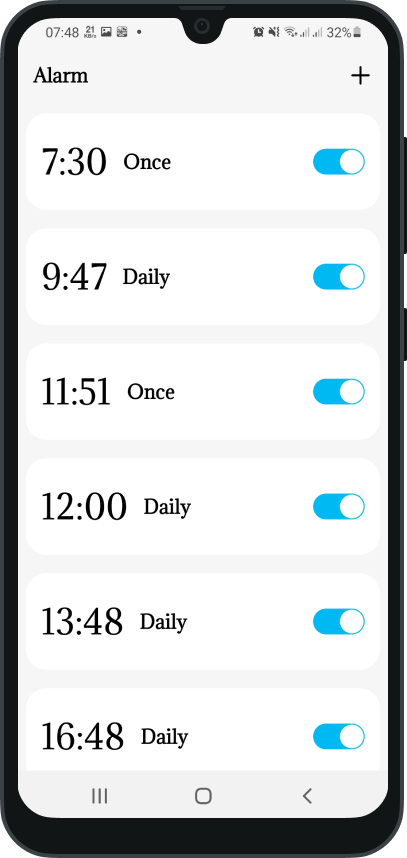
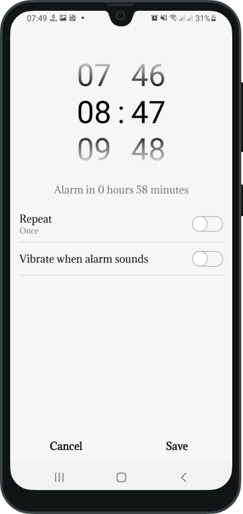
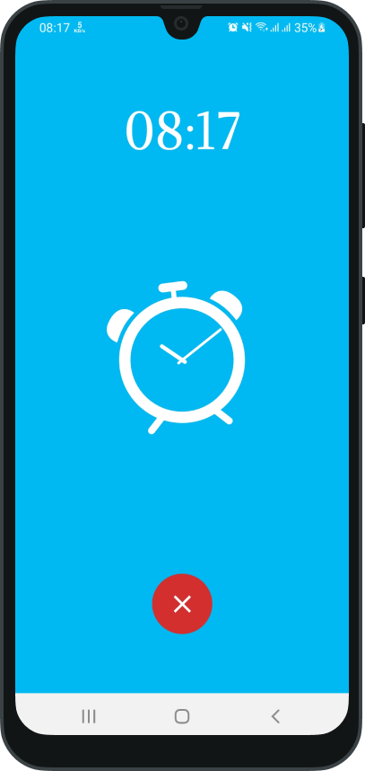
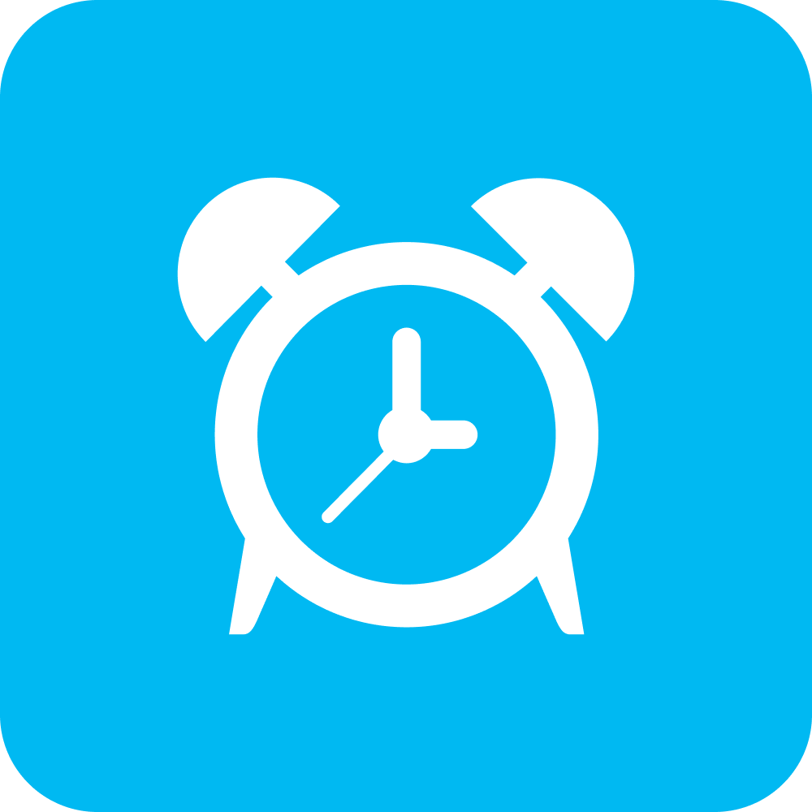

# Alarm

  

https://user-images.githubusercontent.com/77713867/178652593-84c294cd-dc84-4709-b931-aadc70ddbca3.mp4

# Icons

<h3>I made icon for this app.<h3>

# Resources:

<b><a href = "https://lottiefiles.com/98305-alarm-clock">LottieFiles</a><b>

<b><a href = "https://www.figma.com/file/5kCMHfG57bSQvJlz4XyBY3/Untitled?node-id=0%3A1">Figma</a><b>

